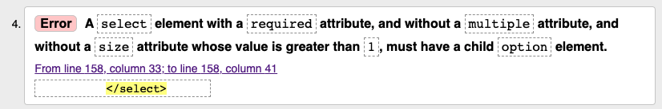

# Grille d'évaluation pour le TP3
## Structure, sémantique, accessibilité, API des formulaires HTML5
- [X] __Regrouper les éléments de formulaire de même nature__ (1 point)
    - Utiliser des `<fieldsets>`
    - Faire des groupes d’`<option>`s dans une liste déroulante
- [X] __Étiqueter__ (1 point)
    - Étiqueter les groupes d’éléments de formulaire
    - Nommer chaque groupe avec une `<legend>`
    - Étiqueter un groupe d’`<option>`s d’une liste déroulante
    - Étiqueter avec un `<label>` les champs de formulaire
- [X] __Tester l'accessibilité__ (.8/1 point)
    - Rendre (garder) le formulaire navigable au clavier
    - Baliser avec précision les éléments de formulaire
    - Bien choisir le type du `<input>`
    - Code sémantique et valide pour l’ensemble du document
- [ ] __Ajouter des containtes de saisie__ (.85/1 point)
    - Identifier par un attribut approprié les champs obligatoires du formulaire
    - Ajouter des contraintes de saisie sur les champs de formulaire

## Styles CSS
- [X] __Aligner les éléments de formulaire__ (1 point)
    - Contrôler les espacements
- [X] __Intégrer tous les contenus__  (1 point)
    - Selon les guides visuels (ou mieux !)
- [X] __Styler l’interactivité__  (.85/1 point)
    - État focus, état checked des éléments de formulaires
    - États des hyperliens (link, visited, hover, active)
    - Styler les messages d’erreur
    - Utiliser des sprites CSS
- [X] __Styler les boutons radio__  (.5/1 point)
    - en les gardant accessibles au clavier

## Méthodes de travail favorisant la collaboration
- [X] __Organiser et documenter la feuille de styles__  (.75/1 point)
- [X] __Utiliser le contrôle des versions GIT__  (1 point)
    - Un minimum de 3 commits est attendu pour les étapes html, css, contrôle qualité finale


## Note et commentaires
<span style='color:red'> 8.75 / 10 </span>

### HTML 
- Une seule erreur HTML constaté par le validateur. 
Il manque une `<option>` avec un `value` vide sur le `<select>`. 
C'est indispensable lorsqu'un `<select>` a un attribut `required`.  


Exemple valide:
```html
 <select name="province" id="province" required>
    <option value>Province ou État</option>
    <optgroup label="Canada">
       <option value="AB">Alberta</option>
```
### CSS
- Il manque des styles d'interactivité (hover et focus) sur les boutons radios
### Accessibilité
- Pour cacher les `<input>` de `type="radio"` il faut utiliser une classe spécifiquement conçue 
pour cacher visuellement tout en gardant accessible pour un lecteur d'écran. 
Ce résultat n'est pas atteint lorsqu'on utilise `display:none`, `visibility:hidden` ou une stratégie comme ici
```css
li input[type=radio] {
    position: absolute;
    left: -9999px;
}
```

## Barème
| Barème | sur 1 |
|--------|-------|
| A+     | 1     |
| A      | 0.95  |
| B+     | 0.9   |
| B      | 0.85  |
| C+     | 0.8   |
| C      | 0.75  |
| D      | 0.65  |
